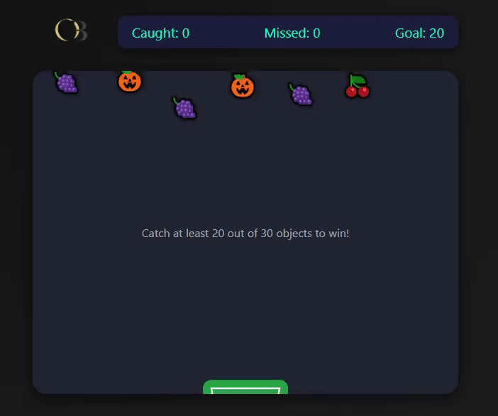

# 🎮 Catch the Falling

  

**Catch the Falling** is a fun web mini-game built with **HTML, CSS, and JavaScript**.  
The goal is simple: **catch at least 20 falling objects out of 30** to win the game!

This project demonstrates my skills in **DOM manipulation, animation, event handling**, and responsive UI design.  

> 💡 *This is one of my earlier projects, recently published on GitHub to showcase my progress in web development*

---

## Game Objective
- Catch **20 or more items** out of 30 to win
- Use **arrow keys** to move the basket

---

## Technologies Used
- HTML
- CSS3
- JavaScript

---

## How to Play
1. Open `index.html` in your browser.
2. Press **Enter** or click **“Start Game”**.
3. Move the basket using the **arrow keys** to catch the falling objects.
4. Reach the target score to win!

---

## Project Structure
catch-the-falling/
├─ index.html
├─ style.css
├─ script.js
├─ image/
│   └─ Mylogo.png
├─ assets/
│   └─ catch-game.gif
└─ README.md

---

## Features
- Interactive gameplay with keyboard control 
- Smooth animations  
- Dynamic difficulty with randomized falling objects 
- Restart system and score tracking

---

## Developer
Created by **Onsa Bezzine**  
